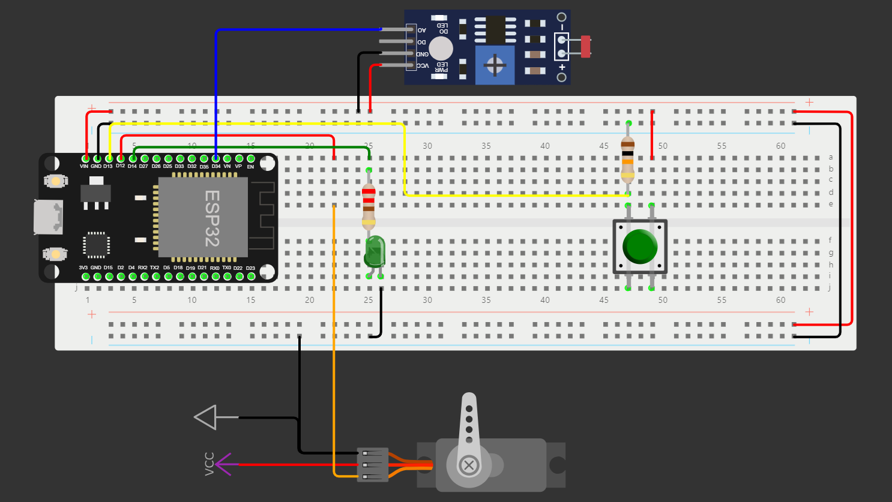
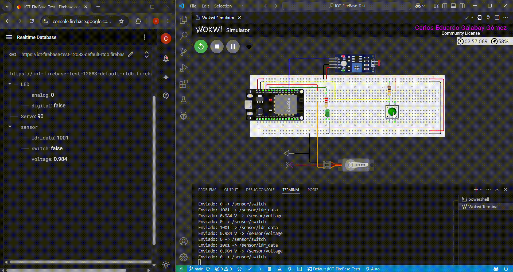

# 🕹️ ESP32 Firebase Control

Este es un ejemplo de cómo conectar un ESP32 con Firebase para controlar dispositivos como un servo y un LED, así como para recolectar datos de un sensor LDR.

El proyecto ha sido desarrollado utilizando [PlatformIO](https://platformio.org/) en VS Code y se ha simulado completamente en [Wokwi](https://wokwi.com/), pero está diseñado para poder implementarse fácilmente en un entorno físico real.

<p align="center">
  
</p>

## ⚙️ Características

- Lectura de sensor LDR y cálculo de voltaje.
- Lectura de estado de un pulsador físico.
- Control remoto de un LED desde Firebase.
- Control de la posición de un servo motor desde Firebase.
- Comunicación bidireccional con Firebase Realtime Database.

## 💻 Tecnologías utilizadas

- ESP32  
- PlatformIO  
- Firebase Realtime Database  
- Firebase ESP32 Client Library  
- Wokwi (simulador)

## Estructura del proyecto

```
ESP32-FireBase-Control/
│
├── IOT-FireBase-Test/         
│   ├── include/
│   │   └── secrets.h          
│   ├── src/
│   │   └── main.cpp           
│   ├── .gitignore             
│   └── platformio.ini         
│
└── LICENSE
```

## 🚀 Instrucciones de Instalación

Sigue estos pasos para instalar y ejecutar el proyecto:

1. **Clona el repositorio**:
    ```bash
    git clone https://github.com/CarlosGalabay/ESP32-Firebase-Control.git
    ```

2. **Abre el proyecto usando la extensión de PlatformIO en VS Code**
    
4. **Configura las credenciales de Firebase**:
    - Crea un archivo `secrets.h` en el directorio `include/` con las credenciales de tu proyecto Firebase.
    - Asegúrate de incluir las siguientes variables en `secrets.h`:
      
    ```cpp
    #ifndef SECRETS_H
    #define SECRETS_H
    
    #define WIFI_SSID "your-SSID"
    #define WIFI_PASSWORD "your-WIFI-password"
    #define API_KEY "your-Firebase-api-key"
    #define DATABASE_URL "your-Firebase-database-url"

    #endif
    ```
    
    - Para ver la ubicación del archivo dentro del proyecto, consulta la sección [Estructura del proyecto](#estructura-del-proyecto).

5. **Compila**:
    - Usa el comando de PlatformIO para compilar el código:
    ```bash
    pio run
    ```

6. **Prueba el proyecto**:
  - Una vez cargado el código, el ESP32 se conectará a Wi-Fi y Firebase.
  - Inicia la simulación usando `Ctrl + Shift + P`, luego escribe y selecciona **Wokwi: Start Simulator**.
  - Verifica que puedas controlar el LED y el servo desde Firebase y leer los datos del sensor LDR.

> [!IMPORTANT]
> Es necesario tener instalado las extensiones de PlatformIO y Wokwi para poder compilar el proyecto y ejecutar la simulación.

## 📸 Demo

Aquí puedes ver una demostración de cómo el ESP32 se conecta a Firebase para controlar un LED y un servo, además de recolectar datos del sensor LDR.

<p align="center">
  
</p>


## 🔧 Uso de Firebase

Este proyecto utiliza Firebase Realtime Database para controlar los dispositivos y almacenar los datos:

- **Control del LED**: La ruta `/LED/digital` en la base de datos controla el estado del LED.
- **Control del Servo**: La ruta `/Servo` en la base de datos controla la posición angular del servo.
- **Lectura de LDR**: Los datos de LDR se almacenan en `/sensor/ldr_data`.
- **Lectura de Voltaje**: Los datos de voltaje se almacenan en `/sensor/voltage`.
- **Estado del Pulsador**: El estado del pulsador se almacena en `/sensor/switch`.

Para interactuar con estos datos, puedes agregar o modificar valores directamente desde Firebase.

<p align="center">
  
</p>


## 📚 Referencias

- [Documentación oficial de Firebase](https://firebase.google.com/docs)
- [Tutorial sobre cómo conectar ESP32 a Firebase](https://www.example.com/tutorial)
- [Wokwi: Simulador de ESP32](https://wokwi.com/)

## 💡 Notas
> [!NOTE]
> Este proyecto está actualmente simulado en Wokwi, lo que permite su prueba sin hardware físico.

> [!TIP]
> Se recomienda probar el código en un entorno real para verificar su funcionamiento con hardware.

## 📜 Licencia

Este proyecto está bajo la Licencia MIT. Para más detalles, revisa el archivo [LICENSE](LICENSE).

## 🚧 Estado del Proyecto

Este proyecto sigue en desarrollo, especialmente en la parte de la aplicación móvil para poder controlar y leer los valores de la base de datos Firebase. Actualmente, el sistema funciona completamente simulado en Wokwi, pero está listo para ser implementado en un entorno real. 


